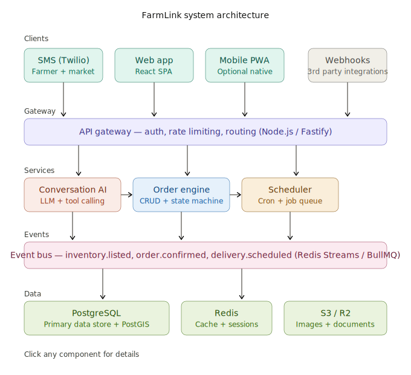
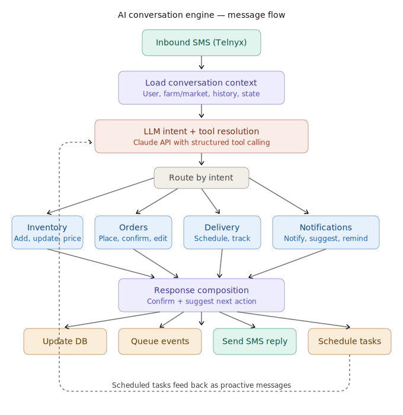

# FarmLink

**Text-first platform connecting farms with markets.**

FarmLink connects small and mid-size farms with grocers, restaurants, co-ops, and farmers markets through a conversational SMS interface powered by an AI assistant. Farmers text to list inventory, markets text to place orders, and the system handles notifications, delivery coordination, standing orders, and analytics — all through natural language.

**Website:** [farmlink.us](https://farmlink.us)

---

## How It Works

```
Farmer texts: "I have 50 lbs of heirloom tomatoes at $3/lb, harvested today"

FarmLink AI: ✅ Listed 50 lbs heirloom tomatoes @ $3/lb.
             Notifying River Market now, Hillcrest Co-op in 1 hour.
             Want to add anything else?

Market texts: "I need 20 lbs of those tomatoes"

FarmLink AI: ✅ Order FL-1234 confirmed!
             20 lbs heirloom tomatoes from Green Acres — $60.00
             Delivery: Thursday 6-10am
```

Users sign up, list inventory, place orders, manage deliveries, and track sales — all via SMS. A web dashboard at [farmlink.us](https://farmlink.us) provides deeper management views.

---

## Architecture

FarmLink is a full-stack TypeScript application with a Fastify API backend, Next.js frontend, and an AI conversation engine at its core.

For detailed technical documentation, see the [Architecture Specification](farmlink_architecture.md).

### System Architecture

<p align="center">
  
</p>

### AI Conversation Engine

The heart of FarmLink is its AI conversation engine. Every inbound SMS flows through a multi-step pipeline: context assembly, Claude API call with tool definitions, tool execution against the database, and natural language response composition.

<p align="center">
  
</p>

### Entity Relationship Diagram

The database schema is documented in an interactive ERD: [farmlink_entity_relationship_diagram.html](farmlink_entity_relationship_diagram.html)

Open the file in a browser to view the full diagram rendered with Mermaid.js.

### Tech Stack

| Layer | Technology |
|-------|-----------|
| **Runtime** | Node.js 20+ / TypeScript 5.7 |
| **API** | Fastify 5 |
| **Database** | PostgreSQL 16 + PostGIS |
| **ORM** | Kysely (type-safe query builder) |
| **Queue** | BullMQ + Redis 7 |
| **AI** | Anthropic Claude API (tool-calling) |
| **SMS** | Telnyx |
| **Frontend** | Next.js 15 / React 19 / Tailwind CSS 4 |
| **Auth** | Phone OTP + JWT |

---

## Project Structure

```
├── src/                          # Backend (Fastify API server)
│   ├── server.ts                 # Entry point
│   ├── config/env.ts             # Environment validation (Zod)
│   ├── routes/                   # REST API endpoints
│   │   ├── auth.ts               # Signup, OTP login, JWT
│   │   ├── sms.ts                # Telnyx webhooks + SMS chat
│   │   ├── farms.ts              # Farm CRUD + relationships
│   │   ├── markets.ts            # Market CRUD + inventory browse
│   │   ├── orders.ts             # Order management
│   │   ├── inventory.ts          # Product listings
│   │   ├── recurring-orders.ts   # Standing orders
│   │   ├── deliveries.ts         # Delivery scheduling
│   │   └── analytics.ts          # Sales metrics
│   ├── services/                 # Business logic
│   │   ├── conversation.ts       # AI conversation engine
│   │   ├── telnyx.ts             # SMS sending (Telnyx API)
│   │   ├── order-notifications.ts
│   │   └── recurring-orders.ts
│   ├── tools/                    # AI tool definitions (14 tools)
│   │   ├── index.ts              # Tool registry + router
│   │   ├── inventory.ts          # inventory_add, inventory_update, inventory_query
│   │   ├── orders.ts             # order_create, order_update, order_query
│   │   ├── markets.ts            # market_query
│   │   ├── recurring.ts          # recurring_order_create/update
│   │   ├── delivery.ts           # delivery_schedule_set, delivery_query
│   │   ├── analytics.ts          # analytics_summary
│   │   ├── signup.ts             # user_signup
│   │   └── notifications.ts     # notify_markets
│   ├── workers/                  # BullMQ job processors
│   │   ├── index.ts              # Notification queue + recurring order scheduler
│   │   └── proactive-jobs.ts     # Scheduled proactive messages
│   ├── db/                       # Database layer
│   │   ├── database.ts           # Kysely connection
│   │   ├── migrations/           # Schema migrations
│   │   └── seed.ts               # Demo data
│   ├── types/schema.ts           # Full TypeScript DB schema
│   ├── middleware/rbac.ts        # Role-based access control
│   └── utils/jwt.ts              # JWT signing/verification
│
├── web/                          # Frontend (Next.js)
│   ├── src/app/                  # App Router pages
│   │   ├── page.tsx              # Landing / dashboard
│   │   ├── login/                # OTP login
│   │   ├── signup/               # Registration
│   │   ├── farmer/               # Farmer dashboard
│   │   ├── market/               # Market dashboard
│   │   ├── chat/                 # Live SMS chat
│   │   └── settings/             # User settings
│   ├── src/components/           # React components
│   ├── src/lib/                  # API client, auth context
│   └── public/                   # Static assets (terms, privacy)
│
├── uploads/                      # User-uploaded files
├── docker-compose.yml            # Local PostgreSQL + Redis
├── farmlink_architecture.md      # Detailed technical spec
├── farmlink_system_architecture.svg
├── farmlink_ai_conversation_engine_flow.svg
└── farmlink_entity_relationship_diagram.html
```

---

## Getting Started

### Prerequisites

- Node.js 20+
- Docker & Docker Compose (for PostgreSQL + Redis)

### Setup

```bash
# Clone the repo
git clone https://github.com/your-org/farmlink.git
cd farmlink

# Start PostgreSQL and Redis
docker-compose up -d

# Install dependencies
npm install
cd web && npm install && cd ..

# Configure environment
cp .env.example .env
# Edit .env with your keys:
#   DATABASE_URL, REDIS_URL,
#   TELNYX_API_KEY, TELNYX_PHONE_NUMBER,
#   ANTHROPIC_API_KEY, JWT_SECRET

# Run database migrations and seed
npm run migrate
npm run seed
```

### Development

Run all three processes in separate terminals:

```bash
# Terminal 1 — API server (port 3000)
npm run dev

# Terminal 2 — Frontend (port 3001)
cd web && npm run dev

# Terminal 3 — Background workers
npm run worker
```

The web app proxies API requests to the backend via Next.js rewrites.

### Environment Variables

| Variable | Description |
|----------|------------|
| `DATABASE_URL` | PostgreSQL connection string |
| `REDIS_URL` | Redis connection string |
| `TELNYX_API_KEY` | Telnyx API key for sending SMS |
| `TELNYX_PHONE_NUMBER` | Your Telnyx phone number (E.164) |
| `TELNYX_MESSAGING_PROFILE_ID` | Telnyx messaging profile (optional) |
| `ANTHROPIC_API_KEY` | Anthropic API key for Claude |
| `JWT_SECRET` | Secret for signing JWT tokens |
| `PORT` | API server port (default: 3000) |
| `NODE_ENV` | `development` or `production` |

---

## Key Features

### AI-Powered SMS Interface
Farmers and markets interact through natural language text messages. The AI assistant parses intent, executes database actions via tool-calling, and responds conversationally.

### Notification Priority System
Farmers control which markets get notified first about new inventory. Priority tiers with configurable delays ensure preferred buyers get first access.

### Standing Orders
Markets set up recurring orders (weekly, biweekly, etc.) that auto-fulfill from inventory. The system checks availability, creates orders, decrements stock, and notifies both parties.

### Proactive Messaging
Scheduled jobs send context-aware messages:
- **Low inventory alerts** — when stock drops below 20%
- **Morning harvest reminders** — standing orders due today
- **Weekly sales summaries** — revenue, order count, top products
- **Standing order confirmations** — 24h advance notice to markets

### Delivery Coordination
Farms set delivery schedules (days + time windows). Orders automatically get assigned to the next available delivery slot.

### Web Dashboard
Full management interface for inventory, orders, analytics, market relationships, and delivery tracking.

---

## Database

14 tables covering users, farms, markets, products, inventory, orders, recurring orders, deliveries, conversations, messages, and notifications. See the [ERD](farmlink_entity_relationship_diagram.html) for the full schema.

```bash
npm run migrate        # Apply migrations
npm run migrate:down   # Rollback last migration
npm run seed           # Seed demo data
```

---

## API Endpoints

### Authentication
| Method | Endpoint | Description |
|--------|----------|-------------|
| POST | `/api/auth/signup` | Register new user |
| POST | `/api/auth/otp/request` | Request OTP code |
| POST | `/api/auth/otp/verify` | Verify OTP, receive JWT |

### SMS
| Method | Endpoint | Description |
|--------|----------|-------------|
| POST | `/api/sms/inbound` | Telnyx inbound webhook |
| POST | `/api/sms/status` | Delivery status callback |
| POST | `/api/sms/chat` | Web-based SMS chat |

### Farms & Markets
| Method | Endpoint | Description |
|--------|----------|-------------|
| GET | `/api/farms/:id` | Farm details |
| GET | `/api/farms/:id/inventory` | Farm inventory |
| GET | `/api/farms/:id/markets` | Connected markets |
| GET | `/api/markets/:id/available` | Browse available inventory |

### Orders & Inventory
| Method | Endpoint | Description |
|--------|----------|-------------|
| GET/POST | `/api/inventory` | List or create inventory |
| PUT | `/api/inventory/:id` | Update listing |
| GET/POST | `/api/orders` | List or create orders |
| PATCH | `/api/orders/:id/status` | Update order status |

### Analytics
| Method | Endpoint | Description |
|--------|----------|-------------|
| GET | `/api/analytics/revenue` | Revenue by period |
| GET | `/api/analytics/top-products` | Best sellers |

See the [Architecture Specification](farmlink_architecture.md) for the complete API reference.

---

## Legal

- [Terms of Service](web/public/terms.html)
- [Privacy Policy](web/public/privacy.html)

---

## License

Proprietary. All rights reserved.
